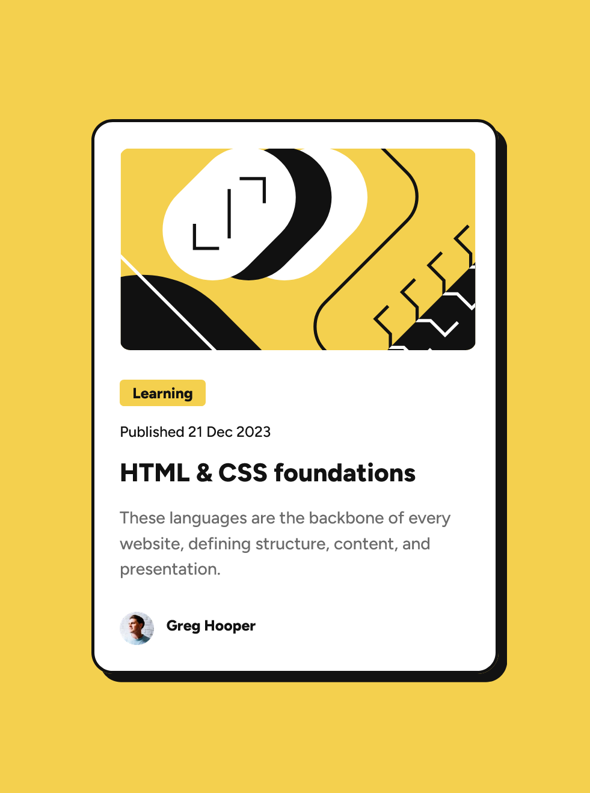

# Frontend Mentor - Blog preview card solution

This is my solution to the [Blog preview card challenge on Frontend Mentor](https://www.frontendmentor.io/challenges/blog-preview-card-ckPaj01IcS). Frontend Mentor challenges help you improve your coding skills by building realistic projects. 

## Table of contents

- [Overview](#overview)
  - [The challenge](#the-challenge)
  - [Screenshot](#screenshot)
  - [Links](#links)
- [My process](#my-process)
  - [Built with](#built-with)
  - [What I learned](#what-i-learned)
  - [Continued development](#continued-development)
  - [Useful resources](#useful-resources)
  - [AI Collaboration](#ai-collaboration)
- [Author](#author)
- [Acknowledgements](#acknowledgements)

## Overview

### The challenge

Users should be able to:

- See hover and focus states for all interactive elements on the page

### Screenshot



### Links

- Solution URL: [github repo (this page)](https://github.com/ElwinBeall/FEM_blog-preview-card)
- Live Site URL: [github.io page](https://elwinbeall.github.io/FEM_blog-preview-card/)

## My process

### Built with

- Semantic HTML5 markup
- CSS custom properties with media query
- Flexbox
- CSS Grid
- Mobile-first workflow
- [Styled Components](https://styled-components.com/) - For styles

### What I learned

Having been mostly a backend developer for my first two years in Web Development, I decided to focus on frontend and complete some challenges at Frontend Mentor.  I'm finding myself remembering a lot about CSS and learning a even more in the process.

Trying to keep semantic HTML a priority, but I still find <div> elements handy. :smirk:

```html
<body>
    <main>
      <article class="card">
        <div class="card-image">
          
.
.
.
```

Using media query for responsiveness.  Also using **em** for font sizing.

```css
@media (min-width: 540px) {
  .card {
    /*
      Surface Duo (width: 540px) and larger
        width: 384px;
        height: 522px;
    */
    width: 384px;
    height: 522px;
  }
  .card-image {
    width: 336px;
    height: 200px;
  }
  .card-category {
    font-size: 0.875em;
  }
.
.
.
```

### Continued development

During my searches for docs and howtos, I'm finding some interesting CSS and JS for making photo carousels.  I even found an example of one converted to WebGL that was cool.  

In my spare time, I'm continuing online coursework and completing challenges at Frontend Mentor.  

### Useful resources

- [PX to EM Converter](https://www.w3schools.com/tags/ref_pxtoemconversion.asp) - If you're too lazy to divide by 16, or have been staring at CSS too long to remember to, this calculator may come in handy.
- [MDN CSS reference](https://developer.mozilla.org/en-US/docs/Web/CSS/Reference) - This reference, and the one at the above domain, are great for looking up things you forgot.  You can quickly resolve the question, "Does the padding property put left and right first; or is it top and bottom?".

### AI Collaboration

I haven't gotten very involved in using AI yet.  I've checked out Ollama and written a few prompts to play an ad-hoc text adventure, but nothing very useful.  I've even played around with **Cursor**, but I like **VSCode** with Gemini extension better (though I keep it off when not learning how to use it).

## Author

- Elwin Beall - [Elwin Beall](https://www.your-site.com)
- Frontend Mentor - [@ElwinBeall](https://www.frontendmentor.io/profile/ElwinBeall)

## Acknowledgements

Thanks to everyone who has reviewed my challenges, commented or helped out in some way.
